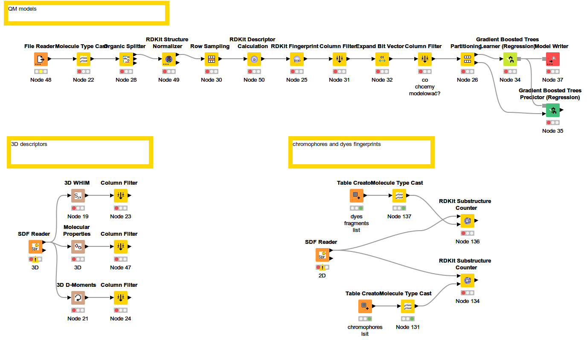

# Modeling Pipeline

Scripts used to train, evaluate, and ensemble AutoML (FLAML) models for the four EUOS25 Challenge
optical-property prediction targets (fluorescence 340/450 nm, fluorescence 480/540+ nm,
transmittance 340 nm, transmittance >450 nm). Datasets are expected under `4-datasets/` (not included due to its size).

## Descriptors

### KNIME pipeline

- **`KNIME/EUOS-pipelines.knwf`** -- scripts to calculate descriptors in KNIME: 3D descriptors, QSPR models for QM parameters

## Main pipeline (run in order)

- **`flaml-0-run_them_all.sh`** -- Master orchestrator. Configures the descriptor set, target
  list, time budget, and sample-weighting strategy, then runs steps 1–9 below in sequence for
  each target. Steps are optional (skipped if their output already exists).
- **`flaml-1-optimize.py`** -- Runs FLAML AutoML optimization over `catboost`, `rf`, `xgboost`,
  `extra_tree`, `lgbm`, and `xgb_limitdepth`, producing a JSON-lines trial log
  (`flaml_logs/optimization.log`). Supports optional warm-starting from prior best configs and
  sample weighting for class imbalance.
- **`flaml-2-extract.py`** -- Parses the FLAML JSON-lines log and extracts the top-N
  configurations per learner into `configs/best_configs.json`, plus diagnostic plots.
- **`flaml-3-train_on_best_configs.py`** -- Retrains the top-N extracted configs on the full
  training set and generates test-set and global (unlabeled) predictions plus submission files.
- **`flaml-3-make_predictions_on_training_with_best_config.py`** -- Generates 5-fold
  out-of-fold (OOF) predictions on the training set for the same best configs, used downstream
  for consensus/semi-supervised training without leakage.
- **`flaml-4-consensus.py`** -- Builds ensemble predictions by averaging all 2- and 3-model
  combinations of the trained models and evaluates their AUROC.
- **`flaml-4-train_semisupervised.py`** -- Uses the unlabeled global test set for semi-supervised
  learning (simple/iterative/ensemble/co-training strategies) to attempt to boost performance
  beyond the supervised models.
- **`flaml-9-summarize.py`** -- Compares individual, consensus, and semi-supervised results per
  target, selects the best method, and writes the final `final_submission.csv`.

## Auxiliary run scripts

- **`flaml-4-train_semisup_selected.sh`** -- Convenience wrapper that runs semi-supervised
  training (`flaml-4-train_semisupervised.py`) for a hardcoded subset of targets/experiment
  directories, outside of the full `flaml-0-run_them_all.sh` orchestration.

## Scripts for analyses

- **`analyses/ablation_study.py`** -- script used for ablation study
- **`analyses/base_models.py`** -- script for deriving base models
- **`pains/benchmark_structural_alerts.py`** -- script for comparison with PAINS, REOS et al.
