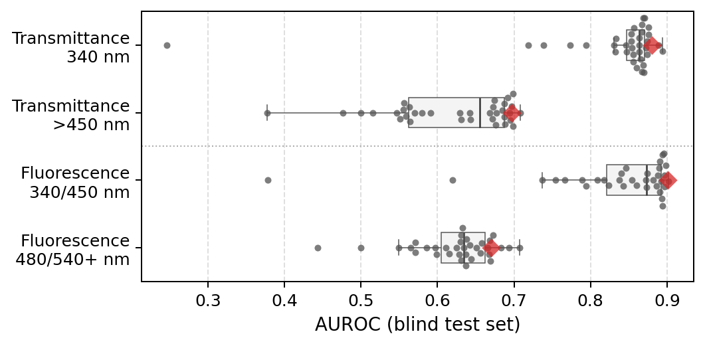

# Data accompanying EUOS Challenge manuscript *Domain-aware feature engineering and automated hyperparameter optimization for prediction of molecular optical interference in high-throughput screening*

- Group name: filipsPL
- ranked 2nd in the transmittance challenge and 3rd in the fluorescence challenge 💪



**Fig.** Distribution of AUROC values (box plots) and individual performance of groups (swarm plot) across the challenge subtasks. The performance of models presented in this work is marked with red diamonds.

See:
- 2nd EUOS/SLAS joint challenge: Prediction of spectral properties of compounds [https://doi.org/10.1016/j.slast.2025.100374](https://doi.org/10.1016/j.slast.2025.100374)
- [OCHEM](https://ochem.eu/static/challenge2025.do)

## Data

```
├── 1-descriptors
│   ├── chromophores.smi                # chromophores used
│   ├── dyesMurckoScaffolds.csv         # Murcko scaffolds of dyes and fluorophores
│   └── dyes.smi                        # dyes used to derive dyesMurckoScaffolds.csv 

├── 2-results                           # Results of experiments
│   ├── ablation                        # - ablation study
│   ├── base_models                     # - baseline models
│   ├── feature_importance              # - feature importances from xgboost and catboost
│   └── meta-learning                   # - meta lerning performance
```

